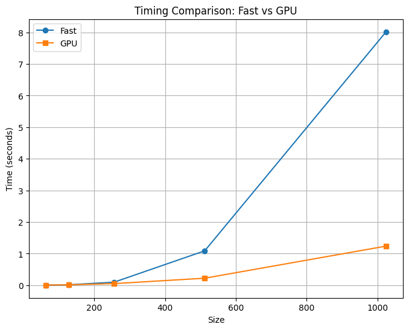

[](https://classroom.github.com/a/YFgwt0yY)
# MiniTorch Module 2


* Docs: https://minitorch.github.io/

* Overview: https://minitorch.github.io/module2/module2/

This assignment requires the following files from the previous assignments. You can get these by running

```bash
python sync_previous_module.py previous-module-dir current-module-dir
```

The files that will be synced are:

        minitorch/operators.py minitorch/module.py minitorch/autodiff.py minitorch/scalar.py minitorch/scalar_functions.py minitorch/module.py project/run_manual.py project/run_scalar.py project/datasets.py

---
# NUMBA Parallel Check
Please refer to the full logs [here](parrallel_check_output.txt).

# Performance Analysis: Fast Ops vs. GPU


# Tensor Model Performance

This document presents the results and training performance for a Tensor model on three datasets. Additionally, the time per epoch for each model size is recorded for analysis.

## Results Summary

### Model with HIDDEN = 100

#### Dataset: Split
- **Backend**: GPU
- **Rate**: 0.05
- **Final Accuracy**: 50
- **Final Loss**: 0.1694
- **Average Time Per Epoch**: 2.53 seconds

#### Detailed Metrics:
| **Epoch** | **Loss**    | **Accuracy (Correct)** | **Time (s)** |
|-----------|-------------|------------------------|--------------|
| 0         | 6.3235      | 36                     | 5.86         |
| 10        | 7.1710      | 38                     | 2.28         |
| 20        | 5.5119      | 37                     | 2.26         |
| 30        | 4.3157      | 42                     | 2.28         |
| 40        | 4.5692      | 48                     | 2.84         |
| 50        | 3.4305      | 45                     | 3.40         |
| 100       | 2.2438      | 47                     | 2.35         |
| 200       | 1.2624      | 48                     | 2.30         |
| 300       | 1.9558      | 46                     | 2.26         |
| 400       | 0.0764      | 47                     | 2.28         |
| 490       | 0.1694      | 48                     | 2.29         |

#### Dataset: Split
- **Backend**: CPU
- **Rate**: 0.05
- **Final Accuracy**: 50
- **Final Loss**: 0.0815
- **Average Time Per Epoch**: 0.52 seconds

#### Detailed Metrics:
| **Epoch** | **Loss**    | **Accuracy (Correct)** | **Time (s)** |
|-----------|-------------|------------------------|--------------|
| 0         | 6.9960      | 24                     | 10.53        |
| 10        | 5.5020      | 36                     | 0.72         |
| 20        | 4.8204      | 41                     | 0.46         |
| 30        | 5.2119      | 45                     | 0.48         |
| 40        | 3.5794      | 45                     | 0.44         |
| 50        | 3.1032      | 48                     | 0.47         |
| 100       | 1.0665      | 48                     | 0.46         |
| 200       | 0.7854      | 49                     | 0.47         |
| 300       | 0.4290      | 47                     | 0.69         |
| 400       | 0.7552      | 49                     | 0.40         |
| 490       | 0.0815      | 48                     | 0.39         |

#### Dataset: Xor
- **Backend**: GPU
- **Rate**: 0.05
- **Final Accuracy**: 50
- **Final Loss**: 0.3053
- **Average Time Per Epoch**: 2.49 seconds

#### Detailed Metrics:
| **Epoch** | **Loss**    | **Accuracy (Correct)** | **Time (s)** |
|-----------|-------------|------------------------|--------------|
| 0         | 6.3894      | 29                     | 4.13         |
| 10        | 4.9741      | 44                     | 2.24         |
| 20        | 3.4899      | 42                     | 2.51         |
| 30        | 4.3683      | 45                     | 3.27         |
| 50        | 2.5055      | 47                     | 2.23         |
| 100       | 1.4389      | 48                     | 2.26         |
| 200       | 0.1085      | 49                     | 2.76         |
| 300       | 1.8098      | 49                     | 2.26         |
| 400       | 0.7374      | 50                     | 2.22         |
| 490       | 0.3053      | 50                     | 2.24         |

#### Dataset: Xor
- **Backend**: CPU
- **Rate**: 0.05
- **Final Accuracy**: 50
- **Final Loss**: 0.3051
- **Average Time Per Epoch**: 0.46 seconds

#### Detailed Metrics:
| **Epoch** | **Loss**    | **Accuracy (Correct)** | **Time (s)** |
|-----------|-------------|------------------------|--------------|
| 0         | 9.3620      | 25                     | 9.07         |
| 10        | 4.8969      | 42                     | 0.39         |
| 20        | 4.1309      | 43                     | 0.40         |
| 30        | 2.6534      | 40                     | 0.39         |
| 50        | 3.3025      | 45                     | 0.39         |
| 100       | 1.9008      | 48                     | 0.40         |
| 200       | 0.3496      | 48                     | 0.39         |
| 300       | 0.2188      | 47                     | 0.40         |
| 400       | 2.7208      | 47                     | 0.43         |
| 450       | 0.0448      | 50                     | 0.38         |
| 490       | 0.3051      | 49                     | 0.40         |

#### Dataset: Simple
- **Backend**: GPU
- **Rate**: 0.05
- **Final Accuracy**: 50
- **Final Loss**: 0.0791
- **Average Time Per Epoch**: 2.51 seconds

#### Detailed Metrics:
| **Epoch** | **Loss**    | **Accuracy (Correct)** | **Time (s)** |
|-----------|-------------|------------------------|--------------|
| 0         | 5.4720      | 32                     | 4.28         |
| 10        | 2.0505      | 49                     | 2.28         |
| 20        | 1.3684      | 49                     | 2.27         |
| 30        | 1.2466      | 50                     | 2.25         |
| 50        | 0.9308      | 50                     | 2.27         |
| 100       | 0.2790      | 50                     | 3.31         |
| 200       | 0.0540      | 50                     | 2.71         |
| 300       | 0.2265      | 50                     | 2.27         |
| 400       | 0.1502      | 50                     | 2.25         |
| 490       | 0.0791      | 50                     | 3.00         |

#### Dataset: Simple
- **Backend**: CPU
- **Rate**: 0.05
- **Final Accuracy**: 50
- **Final Loss**: 0.0892
- **Average Time Per Epoch**: 0.47 seconds

#### Detailed Metrics:
| **Epoch** | **Loss**    | **Accuracy (Correct)** | **Time (s)** |
|-----------|-------------|------------------------|--------------|
| 0         | 5.8995      | 40                     | 8.41         |
| 10        | 2.4658      | 49                     | 0.38         |
| 20        | 2.1269      | 45                     | 0.38         |
| 30        | 1.0329      | 49                     | 0.67         |
| 50        | 1.1423      | 49                     | 0.39         |
| 100       | 0.3197      | 49                     | 0.39         |
| 200       | 0.1584      | 49                     | 0.40         |
| 300       | 0.1080      | 49                     | 0.40         |
| 400       | 0.9219      | 49                     | 0.40         |
| 490       | 0.0892      | 49                     | 0.43         |

### Model with HIDDEN = 200

#### Dataset: Split
- **Backend**: GPU
- **Rate**: 0.05
- **Final Accuracy**: 50
- **Final Loss**: 1.9171
- **Average Time Per Epoch**: 3.33 seconds

#### Detailed Metrics:
| **Epoch** | **Loss**    | **Accuracy (Correct)** | **Time (s)** |
|-----------|-------------|------------------------|--------------|
| 0         | 8.2642      | 32                     | 7.49         |
| 10        | 3.7366      | 45                     | 2.98         |
| 20        | 2.4236      | 46                     | 3.96         |
| 30        | 4.0389      | 42                     | 3.03         |
| 50        | 2.7921      | 47                     | 2.98         |
| 100       | 1.5828      | 49                     | 3.11         |
| 200       | 0.7696      | 49                     | 3.00         |
| 300       | 0.3824      | 47                     | 3.00         |
| 400       | 1.7441      | 45                     | 3.66         |
| 490       | 1.9171      | 49                     | 2.98         |

#### Dataset: Split
- **Backend**: CPU
- **Rate**: 0.05
- **Final Accuracy**: 50
- **Final Loss**: 0.2292
- **Average Time Per Epoch**: 1.54 seconds

#### Detailed Metrics:
| **Epoch** | **Loss**    | **Accuracy (Correct)** | **Time (s)** |
|-----------|-------------|------------------------|--------------|
| 0         | 10.9304     | 32                     | 10.08        |
| 10        | 8.3063      | 21                     | 1.36         |
| 20        | 7.8858      | 42                     | 1.35         |
| 30        | 3.3216      | 46                     | 1.35         |
| 50        | 2.5228      | 49                     | 1.79         |
| 100       | 0.7284      | 49                     | 2.02         |
| 200       | 1.2426      | 49                     | 1.35         |
| 300       | 0.5789      | 50                     | 1.36         |
| 400       | 0.2085      | 50                     | 1.35         |
| 490       | 0.2292      | 50                     | 1.34         |
